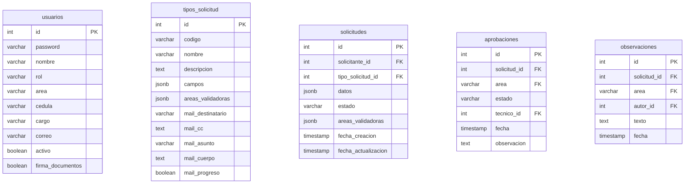
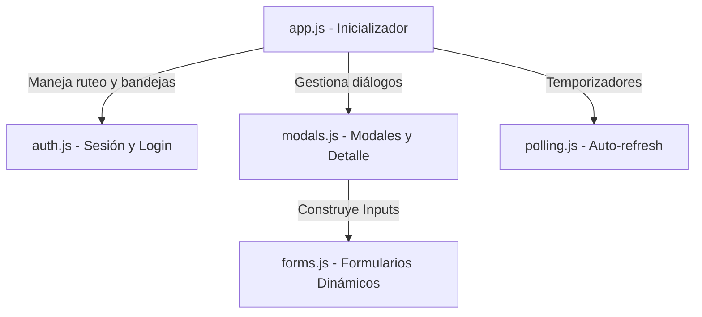

# Manual Técnico Integral - Sistema de Validación Técnica (SVT)

Este manual proporciona una especificación técnica de bajo nivel del Sistema de Validación Técnica (SVT). Su propósito es servir como la guía de referencia definitiva para el mantenimiento, despliegue y desarrollo continuo de la aplicación.

---

## 1. Arquitectura de Software

SVT está diseñado bajo un modelo cliente-servidor desacoplado a nivel de lógica, pero empaquetado conjuntamente para facilitar el despliegue.

### Vista de Componentes y Flujo de Comunicación

```mermaid
graph TD
  subgraph Capa de Presentación (Frontend SPA)
    HTML[index.html] --- CSS[Estilos Vanilla CSS]
    HTML --- JS[Módulos JavaScript ES6]
    JS --> State[Gestión de Estado state.js]
  end

  subgraph Capa de Red e Intercepción
    API[Cliente API api.js] -->|Peticiones HTTP + JWT Bearer| Express[Servidor Express server.js]
  end

  subgraph Capa de Negocio (Backend)
    Express -->|Middlewares| Middleware[auth.js]
    Middleware -->|Rutas REST| Routes[routes/]
    Routes -->|Lógica Transaccional| Services[services/]
  end

  subgraph Capa de Integración
    Services -->|N nodemailer| Mailer[mailer.js]
    Services -->|PDF pdfkit| PDF[pdfGenerator.js]
  end

  subgraph Capa de Datos
    Services -->|Helpers de Consultas| dbHelper[dbHelper.js]
    dbHelper -->|Pool pg| DB[db.js]
    DB --> Postgres[(PostgreSQL DB)]
  end
```

### Principios de Diseño
1. **Single Page Application (SPA) Pura:** Todo el renderizado y transiciones de pantalla del cliente ocurren en el navegador mediante manipulación directa del DOM (Document Object Model) y gestión de estado reactiva local. No se utilizan frameworks pesados (React, Angular o Vue), optimizando el tiempo de carga y eliminando pasos de compilación.
2. **Capa de Servicios Aislada:** La lógica de negocio pesada, especialmente los límites transaccionales de la base de datos, reside en archivos de servicio dedicados (`services/`). Los enrutadores de Express (`routes/`) solo se encargan del parseo de parámetros, control de tipos HTTP y respuestas estructuradas JSON.
3. **Persistencia mediante Pool de Conexiones:** El acceso a la base de datos utiliza un pool gestionado por el driver `pg` que reutiliza conexiones abiertas de forma eficiente, limitando la latencia en entornos concurrentes.

---

## 2. Estructura Física del Proyecto

A continuación se detalla la responsabilidad de cada componente de la aplicación:

### Backend (Lógica de Servidor)
- **`server.js`**: Configura la instancia de Express, monta las cabeceras de seguridad Helmet, registra los codificadores JSON, monta los enrutadores de API de forma segmentada y arranca el servidor HTTP escuchando en el puerto definido tras verificar las migraciones de la base de datos.
- **`db.js`**: Expone una única instancia de `pg.Pool` parametrizada mediante variables de entorno para centralizar y optimizar las transacciones.
- **`dbMigrate.js`**: Lee y ejecuta secuencialmente las instrucciones DDL y DML de `init_db.sql` durante la inicialización de la app si las tablas no existen.
- **`dbHelper.js`**: Centraliza rutinas complejas y reutilizables en SQL. Contiene `inicializarAprobaciones`, la cual regenera firmas pendientes respetando las asignaciones previas de técnicos.
- **`security.js`**: Proporciona rutinas criptográficas seguras: cifrado/verificación de contraseñas mediante derivación de clave PBKDF2 y firma/decodificación de tokens de sesión JWT con algoritmos HMAC-SHA256.
- **`mailer.js`**: Encapsula el transporte SMTP de Nodemailer. Controla colas de envío asíncronas para correos de progreso y solicitudes nuevas.
- **`pdfGenerator.js`**: Motor gráfico basado en `pdfkit` que dibuja el documento técnico final de aprobación (Vistos Buenos), calcula coordenadas dinámicas e inyecta la firma digital de OSI.

### Middlewares
- **`middlewares/auth.js`**:
  - `autenticar`: Intercepta la cabecera `Authorization: Bearer <JWT>`, decodifica el token, verifica que el usuario exista y esté activo en la base de datos, e inyecta el objeto `req.usuario`.
  - `esAdmin`: Verifica que el usuario inyectado tenga el rol `admin` antes de dar paso a las rutas restringidas.

### Capa de Servicios (`services/`)
- **`solicitudService.js`**: Concentra transacciones críticas de base de datos como crear tickets, aprobar firmas por área (conteo de firmas pendientes y cierre automático del ticket en estado general `'aprobado'`), asignaciones de analistas y la reapertura integral de flujos de aprobación.
- **`usuarioService.js`**: Realiza operaciones del administrador como actualizar perfiles de usuarios y sincronizar campos/áreas validadoras de plantillas de formularios de forma reactiva con los tickets activos.

---

## 3. Especificación Detallada de la Base de Datos

El motor de almacenamiento de SVT se estructura en 5 tablas principales optimizadas con índices relacionales.



### Diccionario de Datos

#### Tabla: `usuarios`
Almacena todos los usuarios habilitados para ingresar al sistema.
- `id` (SERIAL, PK): Identificador único interno.
- `password` (VARCHAR(255)): Contraseña cifrada en PBKDF2.
- `nombre` (VARCHAR(100)): Nombres y apellidos completos.
- `rol` (VARCHAR(20)): Rol de acceso (`solicitante`, `tecnico`, `admin`).
- `area` (VARCHAR(20), NULL): Departamento asignado (`seguridad`, `gibdd`, `giitrc`, `osi`, `director`).
- `cedula` (VARCHAR(10), UNIQUE): Cédula de identidad (clave de búsqueda).
- `cargo` (VARCHAR(100)): Cargo institucional.
- `correo` (VARCHAR(100), UNIQUE): Correo institucional.
- `activo` (BOOLEAN, DEFAULT true): Define si el usuario puede loguearse.
- `firma_documentos` (BOOLEAN, DEFAULT false): Determina si se dibuja su firma gráfica en el PDF final.

#### Tabla: `tipos_solicitud`
Define las plantillas de formularios dinámicos diseñadas por el administrador.
- `id` (SERIAL, PK): ID de la plantilla.
- `codigo` (VARCHAR(20), UNIQUE): Código clave del formulario (ej: `ACC-RED`).
- `campos` (JSONB): Matriz de objetos que definen etiquetas, tipos de inputs (text, number, grid, mac, etc.), obligatoriedad y límites de validación.
- `areas_validadoras` (JSONB): Matriz de identificadores de áreas requeridas (ej: `["seguridad", "osi"]`).

#### Tabla: `solicitudes`
Instancia del formulario completado y enviado por un solicitante.
- `datos` (JSONB): Par valor-objeto con las respuestas ingresadas por el solicitante en el formulario dinámico.
- `estado` (VARCHAR(20)): Estado general (`borrador`, `en_revision`, `aprobado`, `observado`).
- `areas_validadoras` (JSONB): Áreas validadoras finales recalculadas al guardar/enviar, basándose en la configuración de la plantilla y los datos específicos del ticket.

#### Tabla: `aprobaciones`
Almacena el estado de las firmas o vistos buenos de cada área validadora involucrada en un ticket.
- `solicitud_id` (INT, FK): Relación con la solicitud.
- `area` (VARCHAR(20)): Área validadora.
- `estado` (VARCHAR(20), DEFAULT `'pendiente'`): Firma (`pendiente`, `aprobado`).
- `tecnico_id` (INT, FK, NULL): Analista responsable asignado.
- `fecha` (TIMESTAMP, NULL): Fecha y hora en la que se aprobó la sección.
- *Restricción única:* `UNIQUE (solicitud_id, area)` evita la duplicidad de firmas por departamento.

---

## 4. API Endpoints (Especificación REST)

Todas las rutas privadas requieren una cabecera `Authorization: Bearer <Token_JWT>`.

| Método | Endpoint | Acceso | Descripción |
| :--- | :--- | :--- | :--- |
| **POST** | `/api/login` | Público | Autentica credenciales y devuelve el token JWT con los datos básicos del usuario. |
| **GET** | `/api/perfil` | Privado | Obtiene los datos del usuario logueado actualmente. |
| **GET** | `/api/solicitudes` | Privado | Obtiene la lista paginada y filtrada de solicitudes según rol del usuario. |
| **POST** | `/api/solicitudes` | Solicitante | Registra una nueva solicitud en estado `'borrador'` o `'en_revision'`. |
| **GET** | `/api/solicitudes/:id` | Privado | Devuelve los detalles de una solicitud, incluyendo firmas e histórico de observaciones. |
| **PUT** | `/api/solicitudes/:id` | Propietario | Modifica los datos de una solicitud (disponible solo en estados `'borrador'` u `'observado'`). |
| **POST** | `/api/solicitudes/:id/aprobar` | Técnico | Registra la aprobación de la sección asignada. Si es la última firma, cierra el ticket como `'aprobado'`. |
| **POST** | `/api/solicitudes/:id/observar` | Técnico | Registra observaciones detalladas y devuelve la solicitud al estado `'observado'`. |
| **POST** | `/api/solicitudes/:id/asignar` | Técnico | Auto-asigna el analista al flujo de firmas del ticket. |
| **POST** | `/api/solicitudes/:id/desasignar` | Técnico | Libera la asignación previa de un ticket. |
| **POST** | `/api/solicitudes/:id/reabrir` | Privado | Reinicia todas las aprobaciones y vuelve el ticket a `'en_revision'`. |
| **GET** | `/api/solicitudes/:id/pdf` | Privado | Genera y descarga el documento oficial firmado en PDF. |

---

## 5. Funcionamiento Detallado del Frontend SPA

La interfaz de usuario es reactiva y se apoya en módulos ES6 estructurados.



### Gestión de Inactividad de Sesión y Refresh (v1.5.8)
- **`polling.js`** administra dos constantes globales sincronizadas:
  - `MAX_INACTIVITY_TIME = 5 * 60 * 60 * 1000` (5 horas): Si no se registran movimientos del ratón (`mousemove`), pulsaciones de teclas (`keypress`) o clics (`click`) en 5 horas, se detiene el polling de actualización en segundo plano para conservar recursos.
  - `MAX_SESSION_INACTIVITY_TIME = 5 * 60 * 60 * 1000` (5 horas): Transcurrido este tiempo sin actividad, el cliente limpia automáticamente el `localStorage` (`svt_user`, `svt_token`) y redirige al login mostrando un aviso de expiración.
- Los listeners de eventos en `public/js/app.js` interceptan las interacciones físicas y llaman a `registrarActividadUsuario()`, restableciendo a cero la marca de tiempo del último contacto.

### Constructor y Validaciones Dinámicas (`forms.js`)
- **Filtro de entrada en tiempo real:** Utiliza expresiones regulares negadas vinculadas a los eventos `keypress` e `input` sobre los elementos HTML creados. Si se introduce un carácter especial no permitido en un input de texto, se filtra al instante.
- **Validación visual inline:** Al perder foco (`blur`), evalúa expresiones regulares del formato (ej: `/^(?:[0-9a-fA-F]{2}:){5}[0-9a-fA-F]{2}$/` para MACs). Si es inválido, inyecta un nodo `.validation-feedback` e ilumina el borde en rojo. Al escribir nuevamente, evalúa reactivamente en el evento `input` para remover los estilos de error en cuanto el formato es corregido.

---

## 6. Manual de Instalación y Despliegue

### Requisitos del Sistema
- **Node.js:** Versión v18 o superior.
- **Base de Datos:** PostgreSQL v14 o superior.
- **Sistema Operativo:** Windows Server 2016+ / Linux (Ubuntu 20.04 LTS+).

### Configuración del Entorno (`.env`)
Antes de iniciar, crea un archivo `.env` en la raíz del proyecto basándote en `.env.example`:

```ini
PORT=3000
APP_URL=http://localhost:3000

# Base de datos
DB_USER=postgres
DB_PASSWORD=contraseña_segura
DB_HOST=localhost
DB_PORT=5432
DB_NAME=svt_db

# Correo SMTP (Salida)
SMTP_HOST=mail.mspsalud.gob.ec
SMTP_PORT=587
SMTP_USER=formularios@mspsalud.gob.ec
SMTP_PASS=contraseña_correo
SMTP_FROM="Sistema de Validación Técnica MSP" <formularios@mspsalud.gob.ec>

# JWT Seguridad
JWT_SECRET=secreto_hexadecimal_largo_y_complejo
JWT_TTL_SECONDS=28800
```

### Ejecución Local
1. Instale las dependencias del proyecto:
   ```bash
   npm install
   ```
2. Ejecute el servidor de desarrollo:
   ```bash
   npm run dev
   ```
3. El sistema creará automáticamente la base de datos y cargará las semillas iniciales (usuarios predeterminados) al detectar que las tablas están vacías. Ingrese a `http://localhost:3000`.

### Despliegue en Producción (con PM2)
Para entornos de producción, se recomienda ejecutar el servidor utilizando el gestor de procesos **PM2**:
1. Instale PM2 globalmente:
   ```bash
   npm install -g pm2
   ```
2. Inicie el proceso de la aplicación:
   ```bash
   pm2 start server.js --name "SVT-Backend"
   ```
3. Configure el inicio automático ante reinicios del servidor:
   ```bash
   pm2 startup
   pm2 save
   ```
